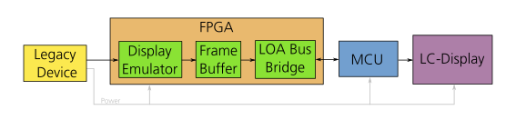

# loa-display-adapter

# Problem solved

A HMP2030 with a broken display. The display is a custom part with no easily available 
replacement (matching electrical & mechanical interfaces).

(It also put some unused evaluation-boards to a good use.)

# Architecture 

A FPGA emulates the protocol used between the powersupplies controller and the broken display, and places this in 
an internal framebuffer. Another microcontroller transfers this framebuffer content to another LC-display. 
The FPGA's gateware is developed using the LOA project and the microcontroller uses large parts of the modm framework.

# Inside the FPGA
Loa provides most of the modules and infrastructure to build the system in the FPGA. The only prupose-build componenet is the 
IP-core that receives the LC-display protocol from the hmp2030 and writes the image into its framebuffer. 
The framebuffer is a dual-ported blockram and connected to the LOA bus, by the reg_file_bram_ice40 module.
The microcontroller accesses the Loa bus via an UART, some HDLC inspired protocol and the hdlc_busmaster_with_support IP-core.

There is also a reset generator, a PLL and a GPIO connected to a single LED to run and debug the FPGA.

# Setup - Dev Host

- Xubuntu 18.04
- modm 2024q3
- xpack-arm-none-eabi-gcc-12.2.1-1.2
- loa 
- HDl containers
    ghdl/synth       beta       fb3e9aaa6e33   
    ghdl/synth       nextpnr    8e4d7630a922   
    ghdl/synth       icestorm   4ac9e23f74e4 

# Setup - Hardware

See doc/images .

- HMP 2030
- IceStick 
- Nucleo F042 Board
- EA 240 display
- Adafruit Breakout board 

